<div align="center">

[中文](https://github.com/Chris1Wang3) · **English**

<br />



<br />


<br />

<a href="#selected-work"></a>
<a href="#how-i-build"></a>
<a href="#toolkit"></a>
<a href="#github-activity"></a>

</div>

<br />

<table>
<tr>
<td width="60%" valign="top">

### About

I am a **Fintech / AI Product Manager** who turns ambiguous business problems into products people can see, test, and improve.

My work sits between product strategy and hands-on delivery: research, product framing, Agent workflows, rapid prototypes, and evidence-backed decision tools.

> I care less about what AI can theoretically do and more about making real business problems clear, turning judgment into repeatable workflows, and shipping results that can be verified.

</td>
<td width="40%" valign="top">

### At a glance

**Focus**<br />
AI-native product workflows

**Current themes**<br />
Product judgment · VoC · Agent Skills

**Bias**<br />
Evidence before opinion

**Output**<br />
Demos · workflows · decision assets

</td>
</tr>
</table>

---

<a id="selected-work"></a>

## 01 / Selected work

<table>
<tr>
<td width="50%" valign="top">

### ⚖️ [Idea on Trial](https://github.com/Chris1Wang3/Idea-on-Trial)

Reusable Agent Skills for the uncomfortable questions that make product decisions stronger.

`Idea stress test` · `Competitive research` · `PRD review` · `Requirement framing` · `Skill QA`

<a href="https://github.com/Chris1Wang3/Idea-on-Trial"></a>

</td>
<td width="50%" valign="top">

### 📡 [VoC Radar](https://github.com/Chris1Wang3/lark-workflow-voc-radar)

An evidence-first Agent workflow that turns scattered Feishu/Lark feedback into a prioritized, reviewable product backlog.

`Multi-source intake` · `Evidence links` · `P0–P3 triage` · `Human approval gates`

<a href="https://github.com/Chris1Wang3/lark-workflow-voc-radar"></a>

</td>
</tr>
</table>

---

<a id="how-i-build"></a>

## 02 / How I build

| Stage | What I do | The artifact |
|:--|:--|:--|
| **Discover** | Find the real user and business tension behind the request | Evidence map · problem statement |
| **Frame** | Make goals, constraints, risks, and success measures explicit | Product brief · decision record |
| **Prototype** | Build the smallest experience that makes the idea discussable | Runnable demo · workflow |
| **Validate** | Pressure-test with users, data, and cross-functional objections | Findings · prioritized fixes |
| **Ship** | Package the result so the next person can reuse and operate it | Skill · playbook · release assets |

```text
good product work = clear problem × testable experience × reusable learning
```

---

<a id="toolkit"></a>

## 03 / Toolkit

<div align="center">


<br />


</div>

---

<a id="github-activity"></a>

## 04 / GitHub activity

<div align="center">


<br />


<br />

<picture>
  <source media="(prefers-color-scheme: dark)" srcset="https://raw.githubusercontent.com/Chris1Wang3/Chris1Wang3/output/github-contribution-grid-snake-dark.svg" />
  <source media="(prefers-color-scheme: light)" srcset="https://raw.githubusercontent.com/Chris1Wang3/Chris1Wang3/output/github-contribution-grid-snake.svg" />
  
</picture>

</div>

---

<div align="center">

### Make the problem clear. Make the solution testable.

[Explore my work](https://github.com/Chris1Wang3?tab=repositories) · [Idea on Trial Skills](https://github.com/Chris1Wang3/Idea-on-Trial) · [SkillHub](https://www.skillhub.cn/dashboard) · [VoC Radar](https://github.com/Chris1Wang3/lark-workflow-voc-radar)

<br />

<sub>Turning real problems into reusable, verifiable outcomes.</sub>

</div>
