<div align="center">

**中文** · [English](https://github.com/Chris1Wang3/Chris1Wang3/blob/main/README.en.md)

<br />



<br />


<br />

<a href="#selected-work"></a>
<a href="#how-i-build"></a>
<a href="#toolkit"></a>
<a href="#github-activity"></a>

</div>

<br />

<table>
<tr>
<td width="60%" valign="top">

### 关于我

我是一名 **金融科技 / AI 产品经理**，擅长把模糊的业务问题拆成看得见、能演示、可验证、可迭代的产品。

我的工作横跨产品策略与动手交付：用户与竞品研究、问题定义、Agent 工作流、快速原型，以及有证据支撑的决策工具。

> 我关注的不只是「AI 能做什么」，而是如何把真实业务问题说清楚、把专业判断产品化，并交付可验证、可复用的结果。

</td>
<td width="40%" valign="top">

### 快速了解

**关注方向**<br />
AI 原生产品工作流

**当前主题**<br />
产品判断 · 用户声音 · Agent Skills

**判断原则**<br />
证据先于观点

**常见交付**<br />
Demo · 工作流 · 决策资产

</td>
</tr>
</table>

---

<a id="selected-work"></a>

## 01 / 代表作品

<table>
<tr>
<td width="50%" valign="top">

### ⚖️ [创意受审 · Idea on Trial](https://github.com/Chris1Wang3/Idea-on-Trial)

把产品决策中那些不好回答、但必须回答的问题，封装成可复用的 Agent Skills。

`想法压测` · `竞品调研` · `PRD 评审` · `模糊需求拆解` · `Skill 质量审计`

<a href="https://github.com/Chris1Wang3/Idea-on-Trial"></a>
<a href="https://www.skillhub.cn/dashboard"></a>

</td>
<td width="50%" valign="top">

### 📡 [用户声音雷达 · VoC Radar](https://github.com/Chris1Wang3/lark-workflow-voc-radar)

把散落在飞书中的用户反馈，转成有证据、可分级、可复核的产品需求池。

`多源采集` · `证据引用` · `P0–P3 分级` · `人工确认门`

<a href="https://github.com/Chris1Wang3/lark-workflow-voc-radar"></a>

</td>
</tr>
</table>

---

<a id="how-i-build"></a>

## 02 / 我的工作方式

| 阶段 | 我会做什么 | 形成的产物 |
|:--|:--|:--|
| **发现** | 找到需求背后真正的用户问题与业务矛盾 | 证据地图 · 问题定义 |
| **定义** | 明确目标、约束、风险与成功指标 | 产品简报 · 决策记录 |
| **原型** | 做出最小但完整、可以讨论的体验 | 可运行 Demo · 工作流 |
| **验证** | 用用户、数据和跨职能质疑检验方案 | 研究结论 · 修复清单 |
| **交付** | 把结果包装成别人可以继续使用和运营的资产 | Skill · Playbook · 发布材料 |

```text
好的产品工作 = 清楚的问题 × 可验证的体验 × 可复用的认知
```

---

<a id="toolkit"></a>

## 03 / 工具箱

<div align="center">


<br />


</div>

---

<a id="github-activity"></a>

## 04 / GitHub 动态

<div align="center">


<br />


<br />

<picture>
  <source media="(prefers-color-scheme: dark)" srcset="https://raw.githubusercontent.com/Chris1Wang3/Chris1Wang3/output/github-contribution-grid-snake-dark.svg" />
  <source media="(prefers-color-scheme: light)" srcset="https://raw.githubusercontent.com/Chris1Wang3/Chris1Wang3/output/github-contribution-grid-snake.svg" />
  
</picture>

</div>

---

<div align="center">

### 把问题说清楚，把方案做出来。

[查看全部项目](https://github.com/Chris1Wang3?tab=repositories) · [创意受审 Skills](https://github.com/Chris1Wang3/Idea-on-Trial) · [SkillHub](https://www.skillhub.cn/dashboard) · [用户声音雷达](https://github.com/Chris1Wang3/lark-workflow-voc-radar)

<br />


</div>
